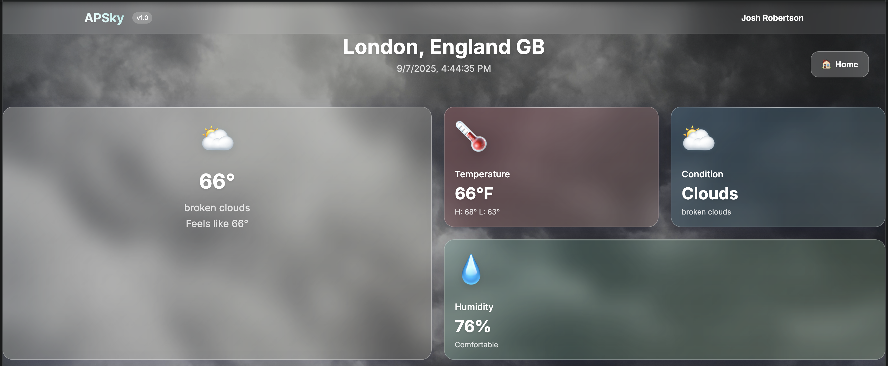
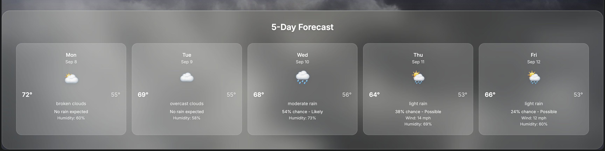

# APSky

**APSky** is a full‑stack weather application built by **Josh Robertson** as a CS portfolio project.  
It allows users to search for cities and view current weather, hourly forecasts, and a 5‑day forecast with detailed metrics such as temperature, humidity, precipitation probability, and wind speed.

---

## Features

- **City Search** – Enter a city name and, if multiple matches exist, select the correct one from a grid.  
- **Current Weather Display** – Temperature, feels‑like, condition, humidity, and high/low temps in a card UI.  
- **5‑Day Forecast** – Daily summaries with icons, temperatures, conditions, precipitation chance, wind, and humidity.  
- **Dynamic Weather Themes** – Icons and background change depending on current conditions.  
- **Responsive UI** – Modern, mobile‑friendly design with modular CSS.  
- **Icon Legend** – Modal explaining weather icons for quick reference.  
- **Demo Cities** – One‑click shortcuts for New York, London, Tokyo, and Sydney.

---

### Homepage  


### City Selector  
When multiple results are found, you can choose the correct city:  


### Current Weather  
Clean card UI with real‑time metrics:  


### 5‑Day Forecast  
Scrollable forecast with icons and details:  


### Dynamic Example  
Backgrounds and icons adapt to the weather:  


---

## Tech Stack

### Backend

| Item | Description |
|------|-------------|
| **Runtime** | Node.js (ES modules enabled) |
| **Framework** | Express.js (v5.1.0) |
| **API** | OpenWeatherMap (geocoding, current, forecast) |
| **HTTP Client** | `node-fetch` (v3.3.2) |
| **Environment** | `dotenv` (v17.0.1) |
| **Server** | Serves static assets from `/public`, runs on port `3000` (or `process.env.PORT`) |

### Frontend

| Item | Description |
|------|-------------|
| **HTML** | Single‑page app in `index.html` |
| **JavaScript** | Vanilla JS in `script.js` for API calls & DOM updates |
| **CSS** | Modular stylesheets in `/public/css/` (`base.css`, `components.css`, etc.) |
| **Assets** | Backgrounds and icons in `/public/static/` |

---

## Project Structure

```
APSky/
├── package.json
├── package-lock.json
├── README.md
├── server.js          # Express server
├── geo.js             # Geocoding functions
├── weather.js         # Weather + forecast logic
├── utils/             # Helpers (e.g. citySelector.js)
├── public/
│   ├── index.html
│   ├── script.js
│   ├── css/
│   └── static/        # Images & backgrounds
└── demo/              # Demo screenshots for README
```

---

## Getting Started

1. **Clone the repository**  
   ```bash
   git clone https://github.com/yourusername/apsky.git
   cd apsky
   ```

2. **Install dependencies**  
   ```bash
   npm install
   ```

3. **Add your OpenWeatherMap API key**  
   Create a `.env` file in the project root with the following content:  
   ```ini
   API_KEY=your_api_key_here
   ```

4. **Run the development server**  
   ```bash
   npm run dev
   ```

5. **Open in your browser**  
   Visit `http://localhost:3000` to view the app.

### Scripts

| Command | Purpose |
|---------|---------|
| `npm start` | Starts the production server |
| `npm run dev` | Starts the server with `nodemon` for live reload |

---

### Notes

- Requires a **valid OpenWeatherMap API key**.  
- `utils/` contains experimental CLI helpers that are not used in the web version.  
- The project is portfolio‑ready with loading states, error handling, and a smooth navigation UX.

---

## License

MIT License – feel free to use or adapt this project for learning purposes.
